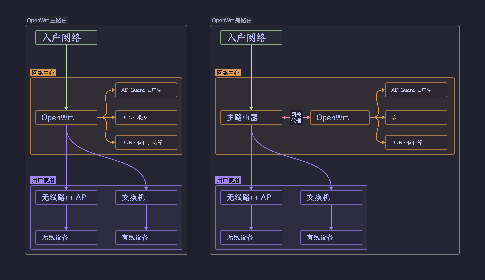

# 为什么使用 OpenWrt

## 什么是 OpenWrt

OpenWrt 是一个用于嵌入式设备的 Linux 操作系统，主要特点：

- 基于 Linux，采用了模块设置，可以方便的定制和扩展；
- 目标是嵌入式设备，因此对硬件要求低，甚至可以替换家用路由器的固件；
- 支持很多平台，包括 x86、MIPS、ARM 等；
- 使用 opkg 包管理，可以方便的安装和管理软件包；
- 支持 IPv6，支持多种 VPN 协议，支持多种文件系统，支持多种文件共享协议；
- 拥有活跃的社区，以及采用 GPL 开源协议；

我最看重的便是**基于 Linux**，这使得我们可以方便的定制，通过它来管理家庭内部的网络实现很多有趣的功能。

## OpenWrt 在家庭网络中的位置

如上图所示常见 OpenWrt 可以有两种使用方法，一种是作为主路由管理家里所有网络设备，还有一种便是作为旁路由通过网关代理提供`特殊功能`。

> 图中只是简单的举例了两种连接方式，旁路由可以有很多其他连接方法，不要杠，想杠你就画图提 PR 补充 😄。

### 主路由模式

主路由的使用模式比较好理解，相当于 OpenWrt 作为一个路由器从入户网络接管，进而控制网络和提供扩展功能。

这种模式主要优点配置比较简单，OpenWrt 上配置好接口与扩展功能设置，即可服务局域网内所有的设备。

而缺点也比较明显：

1. 设备硬件有要求：首先你需要 OpenWrt 系统的设备支持多网口（最少两个）一个 WAN 口，一个 LAN 口，从而接管入户网络。
2. 稳定性问题：OpenWrt 系统自身是很稳定的，但是为了提供更多的功能我们会安装很多第三方插件，这些都会影响系统稳定性，如果你对于自身需求、各种功能使用还处于摸索阶段，不建议直接使用 OpenWrt 作为主路由，很可能搞得家里没网被老婆说 😓。

### 旁路由

旁路由的模式就比较繁琐些，它还可以分为独臂路由、子路由等等情况，这里主要介绍常见的独臂路由情况。

独臂路由顾名思义只有一个网卡，它只能通过一根网线接入网络，那么如何让这个`杨过`牌路由器为我们设备提供网络支持呢？

答案就是网关，指定局域网内的设备网关为独臂路由设备 ip，这样数据将发送给独臂路由器，然后经由独臂路由器发送给主路由。

独臂路由的使用和配置比较繁琐，但是也是有不少的好处：

1. 对于硬件要求不高，你可以使用家里旧电脑、树莓派、甚至虚拟机都可以。
2. 系统出现问题，对于家庭网络影响比较小，只会影响指定过网关的设备，对于其他设备不影响。

如果第一次尝试使用 OpenWrt 非常建议先从虚拟机玩起，没有成本先体验下是否适合自己。

## OpenWrt 版本

OpenWrt 有很多分支，常见如下：

1. [官方主干分支](https://openwrt.org/zh/about)：如果你上网所有会发现 OpenWrt 与 LEDE 这两个名字，不用迷惑 LEDE 是 OpenWrt 的一个分支，不过 2018 年以后已经合并。

2. [Lean's LEDE](https://github.com/coolsnowwolf/lede)：大神针对国内优化的 OpenWrt 版本，默认会提供很多三方插件，自己动手编译镜像非常方便，社区也很活跃。

3. [immortalwrt](https://github.com/immortalwrt/immortalwrt)：同样是针对国内优化版本，提供了在线定制打包等功能很方便，特点在于与官方版本相比，允许使用破解或不可上传的补丁/修改来实现目的，更加灵活部分插件稳定性需要测试下。

推荐初次上手使用官方已发布的镜像尝试安装配置，后续有自己编译定制系统可以在考虑其他的。
