# OpenWrt 安装

[TOC]

## 前言

本文将会介绍如何在 x86 虚拟机和 小米 AC2100 路由器上安装 OpenWrt。

## 镜像下载

首先下载 Openwrt 的镜像，我们可以直接从官网下载已发布的镜像，通常我们会选择 Stable Release：

[OpenWrt Downloads](https://downloads.openwrt.org/)

选择对应平台下载镜像即可。

### 镜像确认

通常需要确认 CPU 型号与架构来选择对应镜像：

OpenWrt 查看：

1. 查看 CPU 型号：`cat /proc/cpuinfo |grep 'system type'`
2. 查看 CPU 架构：`opkg print-architecture`

其他 Linux 查看：

使用 `uname -a` 命令可以查看架构。

### 不同的文件系统区别

以 x86 举例，选择对应平台后可以看到多个镜像文件：

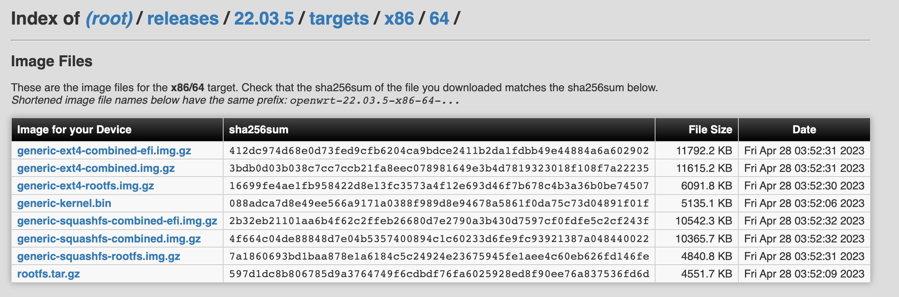

```text
[generic]-[ext4]-[combined]-[efi].[img.gz]

[目标设备类型]-[文件系统]-[组合方式]-[引导方式].[img.gz]
```

- generic：通用 PC，不针对特定品牌主板。
- ext4：使用 ext4 文件系统。
  - squashfs：是一种只读压缩文件系统，主要用于存放只读数据，ext4 可以读写且扩容方便。
- combined：核心系统和基础软件包合并在一个镜像里。
  - rootfs：表示内核和基础软件包是分开的，内核是一个单独的镜像，基础软件包是一个 tar.gz 压缩包。
- efi：使用 EFI 引导方式，而不是 BIOS。
  - EFI 引导可以有效提高速度，但是虚拟机需要些特殊配置。

通常我们选择 **generic-ext4-combined.img.gz** 即可。

## 虚拟机安装

主要介绍 Virtual Box 和 PVE 的安装方法，其他都差不多。

### Virtual Box

1.  解压：`gunzip openwrt-22.03.3-x86-64-generic-ext4-combined.img.gz`
2.  转换格式：`VBoxManage convertfromraw --format VDI openwrt-22.03.3-x86-64-generic-ext4-combined.img openwrt-22.03.3-x86-64-generic-ext4-combined.vdi`

    - VDI(VirtualBox Disk Image)是 VirtualBox 虚拟机使用的虚拟磁盘镜像格式。
    - 使用 VMware 虚拟机也是兼容 VDI，当然也可以转换为 vmdk 格式。

3.  新建虚拟机注册并选择已有的虚拟机文件：

    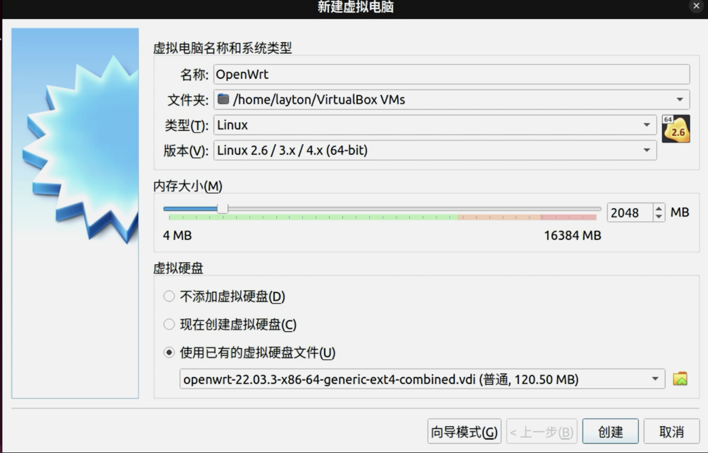

4.  VBox 系统与网络设置则是安装重点，网络配置我们需要三张网卡：

    1. 虚拟机的**eth0**  作为  **mng** (管理) 接口，固定 `ip 192.168.56.2`, VirtualBox 中设置  **仅主机网卡 (Host-only Adapter)**  为  **vboxnet0**。

       - 在**管理 -> 主机网络管理器**中可以添加网卡，虚拟机设置中进行配置。
       - 仅主机网卡 ip 固定以 192.168.56.1 开始。

       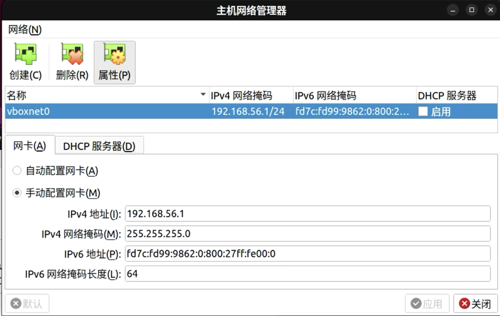
       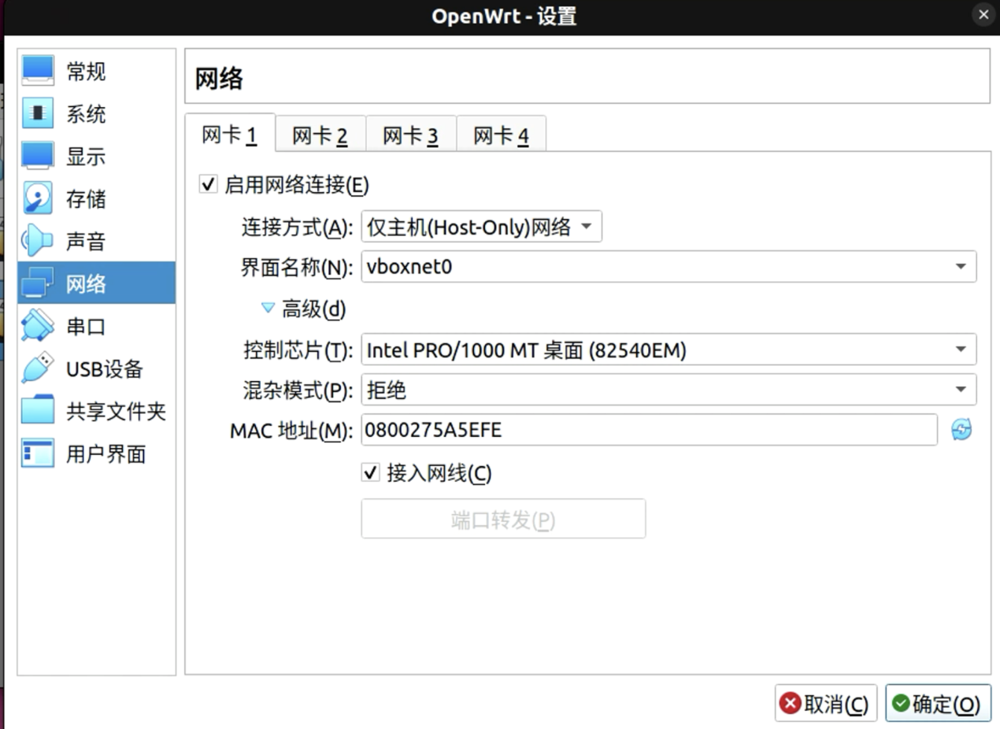

    2. 虚拟机的 **eth1** 作为 **wan** 接口, 动态 ip 地址, 在 VirtualBox 中设置为 **NAT**。这个接口会被用于联网，不管你的宿主机是如何联网的。
       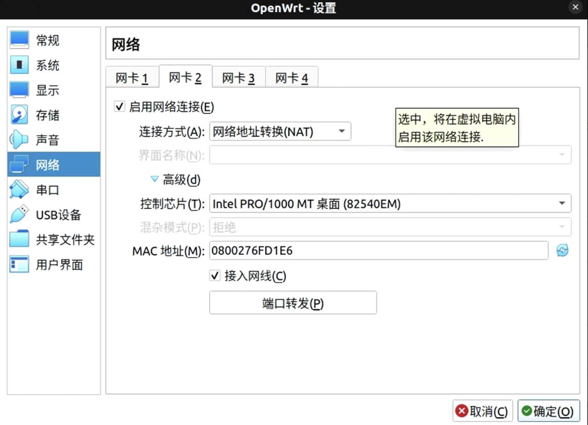

    3. 虚拟机的 **eth2** 作为 **lan** 接口, 配置取决于你的本地网络, 在 VirtualBox 中设置为**桥接网卡 (Bridged Adapter)**。这个网卡允许其他设备 (包括宿主机) 来连接到虚拟机，就好像他是本地网络中的真实存在的物理网卡一样. 只有本地已经有网络的情况下才能生效。
       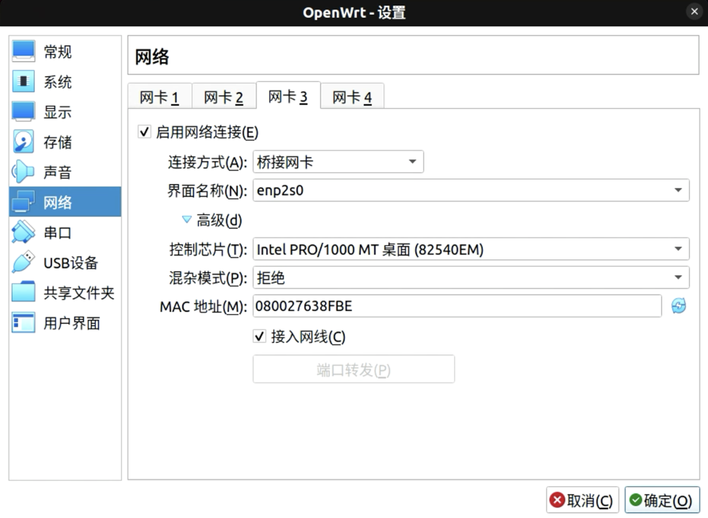

5.  接下来配置 OpenWrt 系统的网络:

    1. 启动虚拟机，等待几秒，在滚动的的信息停止后按下回车进入命令行。
       - 使用 `passwd` 命令设置 root 密码。
    2. 查看网络配置信息 `uci show network`：
       - `interface` 是逻辑网络如：wan、lan、loopback；
       - `device` 是实际网络设备，可能是物理的也可能是虚拟的，处于数据链路层；
       - [OpenWrt Wiki 网络设置](https://openwrt.org/zh-cn/doc/uci/network)。

    ```text
    root@OpenWrt:~# uci show network
    network.loopback=interface
    network.loopback.ifname='lo'
    network.loopback.proto='static'
    network.loopback.ipaddr='127.0.0.1'
    network.loopback.netmask='255.0.0.0'
    network.globals=globals
    network.globals.ula_prefix='fd1b:e541:8f1a::/48'
    network.@device[0]=device
    network.@device[0]='br-lan'
    network.@device[0]='bridge'
    network.@device[0]='eth0'
    network.lan=interface
    network.lan.type='br-lan'
    network.lan.proto='static'
    network.lan.netmask='255.255.255.0'
    network.lan.ip6assign='60'
    network.lan.ipaddr='192.168.1.1'
    network.wan=interface
    network.wan.ifname='eth1'
    network.wan.proto='dhcp'
    network.wan6=interface
    network.wan6.ifname='eth1'
    network.wan6.proto='dhcpv6'
    ```

    3. 首先配置 `lan.ipaddr` 为仅主机网卡 ip 联通，主机网卡为 `192.168.56.1` 这里配置 `192.168.56.2` 即可：

    ```text
    $ uci set network.lan.ipaddr='192.168.56.2'
    $ uci commit
    $ reboot
    ```

    4. 宿主机通过 ssh 工具即可链接到虚拟机中：
       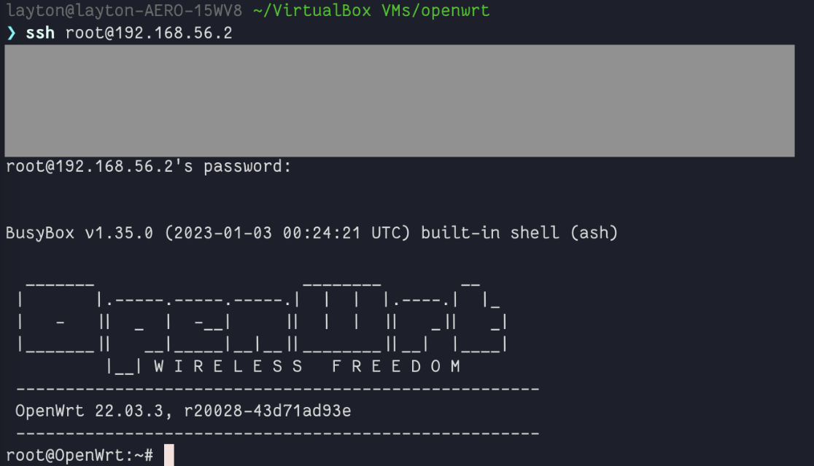

    5. 接下来将将 host 网卡配置到 mng 管理接口上，删除 lan 与 wan，后续再配置：

       ```text
       uci batch <<EOF
       set network.mng=interface
       set network.mng.type='bridge'
       set network.mng.proto='static'
       set network.mng.netmask='255.255.255.0'
       set network.mng.ifname='eth0'
       set network.mng.ipaddr='192.168.56.2'
       delete network.lan
       delete network.wan6
       set network.wan=interface
       set network.wan.ifname='eth1'
       set network.wan.proto='dhcp'
       EOF
       ```

       - `uci changes` 命令进行检查修改，执行 `uci commit && reboot` 生效：

         ```text
         root@OpenWrt:~# uci changes
         network.mng='interface'
         network.mng.type='bridge'
         network.mng.proto='static'
         network.mng.netmask='255.255.255.0'
         network.mng.ifname='eth0'
         network.mng.ipaddr='192.168.56.2'
         -network.lan
         -network.wan6
         network.wan='interface'
         network.wan.ifname='eth1'
         root@OpenWrt:~#
         ```

    6. 重启后，宿主机通过 `ssh root@192.168.56.2` 可以正常登录，浏览器可以正常访问：
       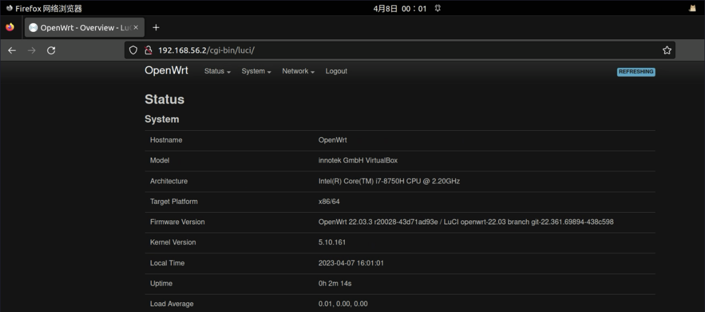

    7. 接下来配置 lan 口 ip 地址，当然如果不想使用命令行这时在宿主机通过浏览器进行配置也是一样的：

       ```text
       $ uci batch <<EOF
       set network.lan=interface
       set network.lan.ifname='eth2'
       set network.lan.proto='static'
       set network.lan.netmask='255.255.255.0'
       set network.lan.ipaddr='192.168.31.69'
       EOF
       $ uci commit
       ```

       - 开启 DHCP：

         ```text
         $ uci batch <<EOF
         set network.lan=interface
         set network.lan.ifname='eth2'
         set network.lan.proto='dhcp'
         EOF
         $ uci commit
         ```

    8. 最终通过其他设备访问桥接 eth2 ip 也可以正常访问：

       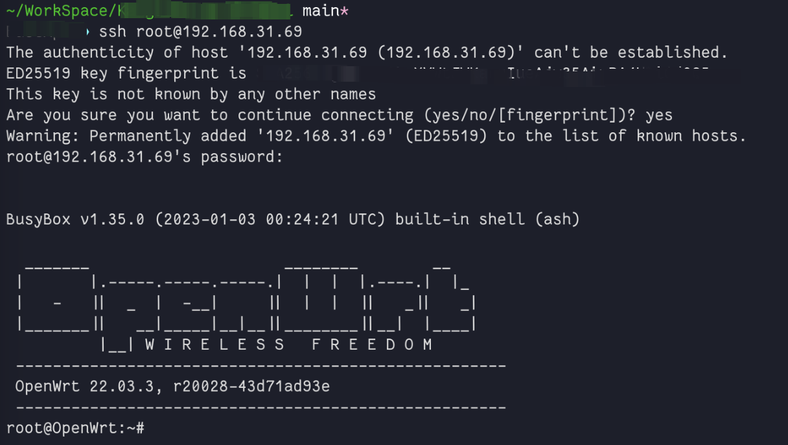

### PVE 虚拟机

1. 首先将 img 镜像导入 PVE 系统中，类似通过 scp 拷贝命令：`scp ~/Downloads/openwrt-22.03.3-x86-64-generic-ext4-combined.img root@pve.lan:~`

2. PVE 创建虚拟机，注意下图中选项，注意硬盘分离后删除：
   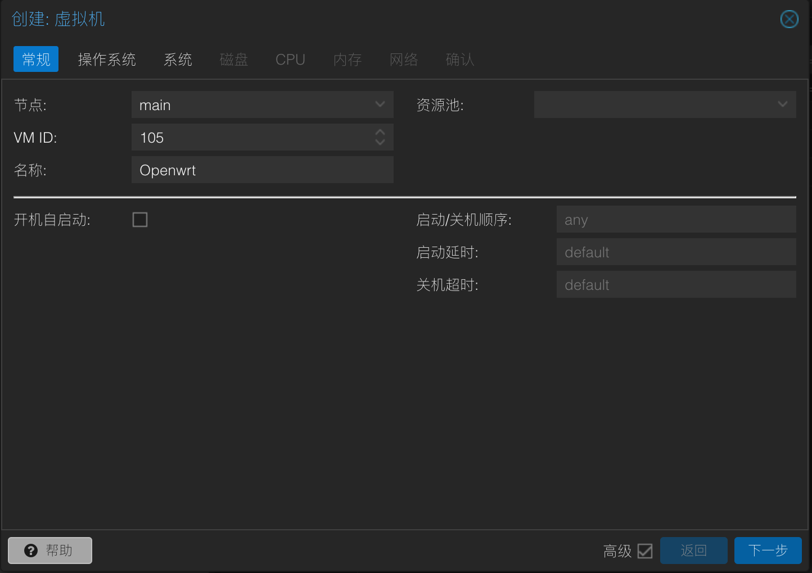
   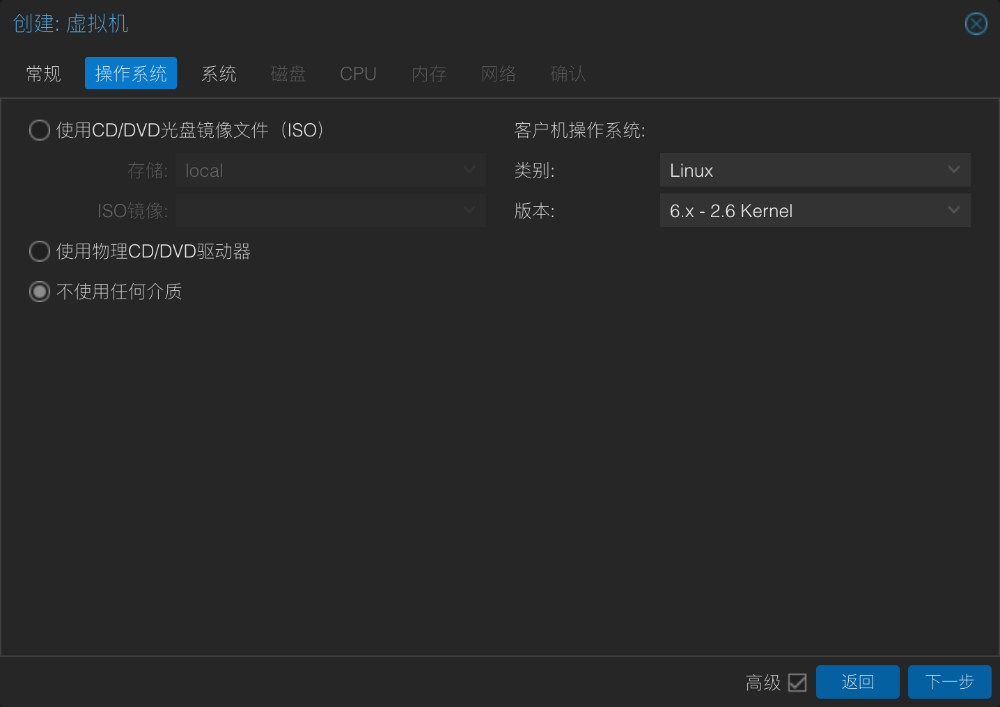
   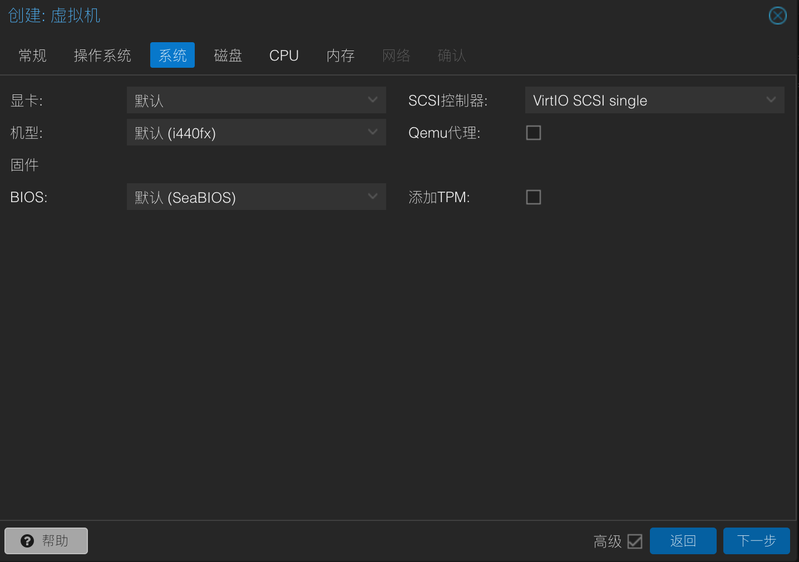
   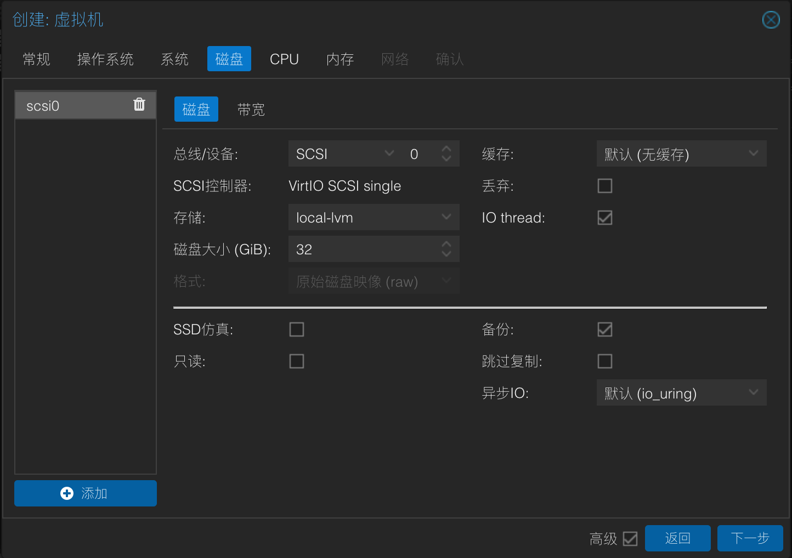
   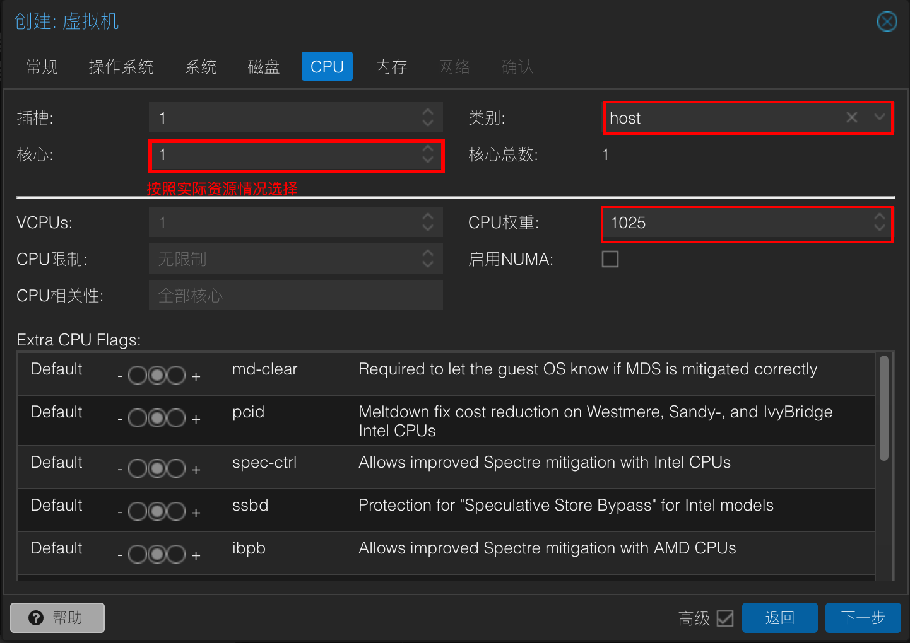
   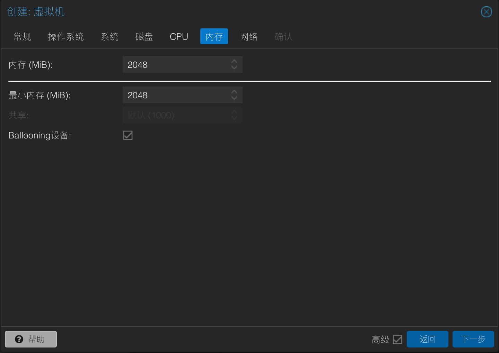
   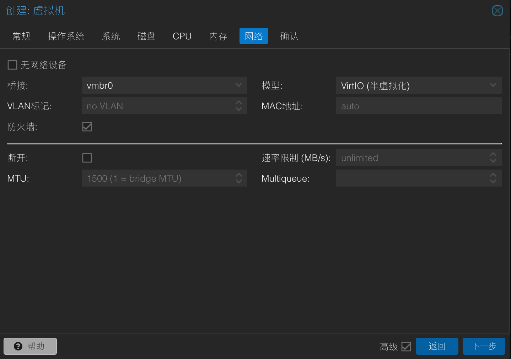

   - 创建完虚拟机首先分离硬盘，删除掉：
     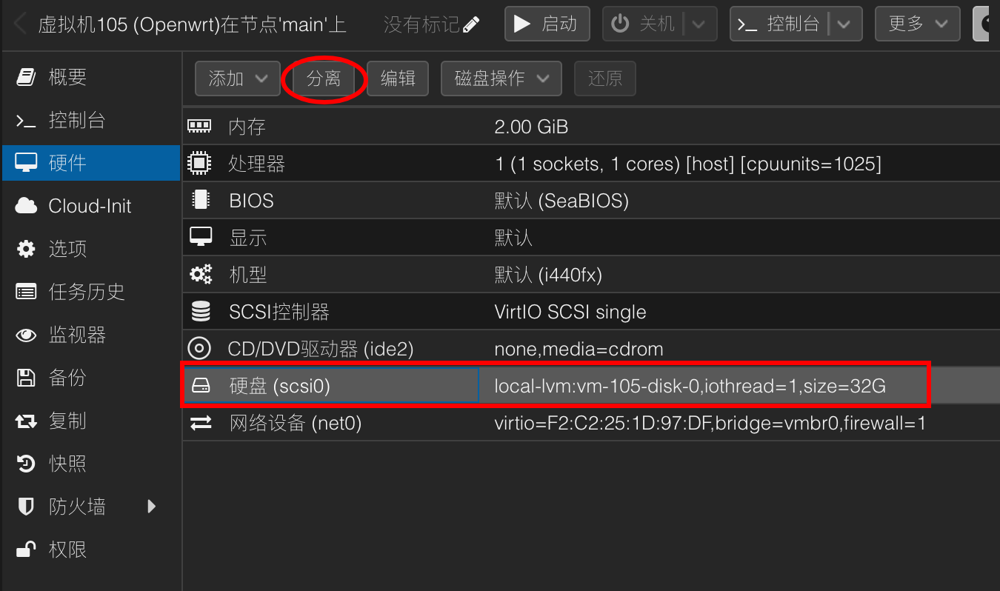

3. 导入 img 镜像：`qm importdisk 105 ~/openwrt-22.03.3-x86-64-generic-ext4-combined.img local-lvm`

   - 105 就是刚刚创建虚拟机的编号；
   - importdisk 命令可以将 img 转换为 Proxmox 支持的磁盘格式如 raw、qcow2 等。

4. 当导入完成后，在硬件管理中会新增为使用的磁盘通过编辑添加即可。
   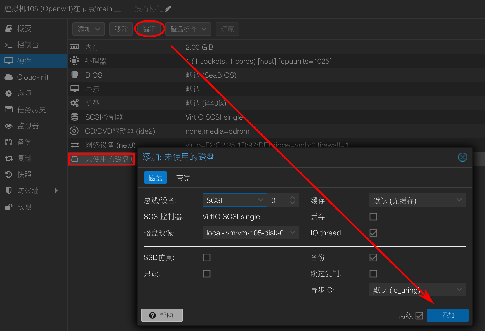

5. 最后调整引导顺序为刚刚新增的磁盘即可：
   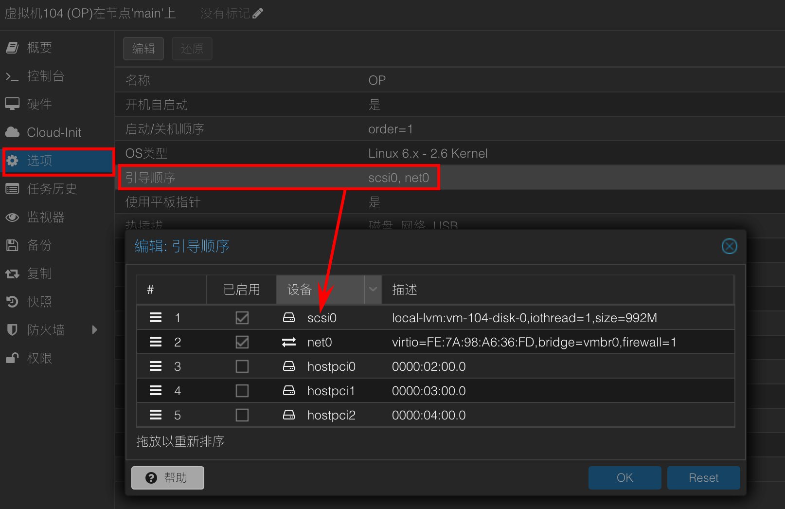

## 小米 AC2100 刷机

### 开启 SSH

1. 系统降级至漏洞版本：[下载](http://cdn.cnbj1.fds.api.mi-img.com/xiaoqiang/rom/r2100/miwifi_r2100_firmware_4b519_2.0.722.bin)。
2. 漏洞注入：
   - 获取 STOK：通过 web 登录路由器，可以在 url 中找到。
   - 注入命令，更改 ip 与 `<STOK>` 即可：`http://192.168.31.1/cgi-bin/luci/;stok=<STOK>/api/misystem/set_config_iotdev?bssid=Xiaomi&user_id=longdike&ssid=-h%3B%20nvram%20set%20ssh_en%3D1%3B%20nvram%20commit%3B%20sed%20-i%20's%2Fchannel%3D.*%2Fchannel%3D%5C%22debug%5C%22%2Fg'%20%2Fetc%2Finit.d%2Fdropbear%3B%20%2Fetc%2Finit.d%2Fdropbear%20start%3B`
   - 更改 root 密码为 admin：`http://192.168.31.1/cgi-bin/luci/;stok=<STOK>/api/misystem/set_config_iotdev?bssid=Xiaomi&user_id=longdike&ssid=-h%3B%20echo%20-e%20'admin%5Cnadmin'%20%7C%20passwd%20root%3B`
3. 重启后即可通过 ssh ip 连接，密码 admin。
   - 如果 ssh 提示需要 ssh-rsa，使用 `ssh -o HostKeyAlgorithms=+ssh-rsa -o PubkeyAcceptedKeyTypes=+ssh-rsa root@192.168.1.1`
   - 第一次连接需要使用 lan 口接入，访问 ip `192.168.1.1`

### 刷入 breed

[hycares/Redmi-AC2100-OpenWRT: 小米红米 AC2100 路由器刷机 (github.com)](https://github.com/hycares/Redmi-AC2100-OpenWRT)

1. 下载 breed ：https://breed.hackpascal.net/breed-mt7621-xiaomi-r3g.bin
2. 刷入 breed bootloader：`mtd -r write /tmp/breed-mt7621-xiaomi-r3g.bin Bootloader`
   - 不通系统类型可能是 uboot 分区。
3. 断电按住 reset 键上电等待指示灯变蓝后松开，通过 PC 直连 lan 口访问 `192.168.1.1` 访问 breed 后台。

### 刷入 openwrt

1. 下载路由器对应镜像：[Index of /releases/22.03.5/targets/ramips/mt7621/ (openwrt.org)](https://downloads.openwrt.org/releases/22.03.5/targets/ramips/mt7621/)
2. 进入 breed 后台，更改环境变量，新增字段 `xiaomi.r3g.bootfw`, 值设置为 `2`，然后保存。
3. 选择 openwrt 分区类型，选择对应 kernel1 与 romfs 进行烧写。

### 重新进入 breed

1. 断电；
2. 按住 reset 上电，10s 后松手；
3. 清除浏览器缓存后访问 192.168.1.1 即可。
