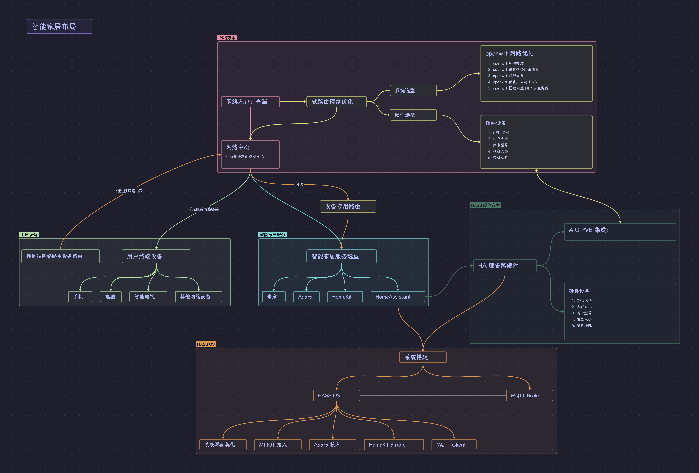

# Overview_SmartHome_Design

## 前言

> 仓库主要包含了我在学习智能家居了解到的相关信息，文章内部分较为零碎的知识细节并不是面向初学者的教学，可以看作一个较为详细的大纲，需要会使用 Google 的技能要求。

我认为合适的智能家居结构应该包括如下几个主要模块：

1. 网络控制中心：统一管理网络情况，网络加速、去广告、优化 DDNS 等功能；
2. 智能家居控制中心：管理全屋电子设备，应当包含充足的可扩展性，不需要大量设置也可以接入新设备；
3. 功能硬件模块：包含检测、交互、语音、操控等设备，可以是成品也可以自由开发。

整理结构如下图：

## 网络优化层

### Openwrt 系统构建

### 插件安装

### 系统设置

## 智能家居服务

### HASS OS 系统安装

### HACS 市场插件安装

### 配置结构设置

### MQTT 设置

## MQTT Broker 服务

### MQTT 协议

### MQTT 服务权限管理

### MQTT 链路加密

### ESP 接入

## 嵌入式开发

### STM32 环境搭建

### ESP32 环境搭建

### STM32 串口通信 ESP8266

### ESP MQTT 接入

## 文件服务器

### Samba 服务

### NetaTalk 服务器

### NAS 服务搭建

## PVE 虚拟系统

### 虚拟机安装

### 系统硬盘管理

### 硬件直通

## 影音媒体服务

### 下载服务器

### 串流共享
